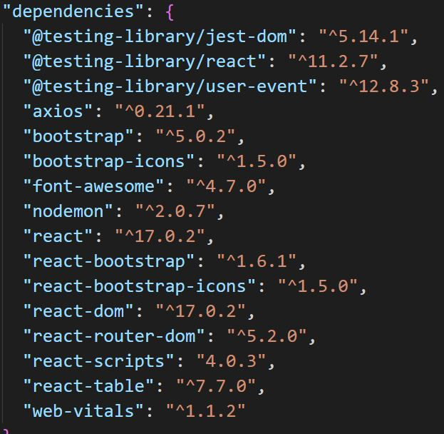
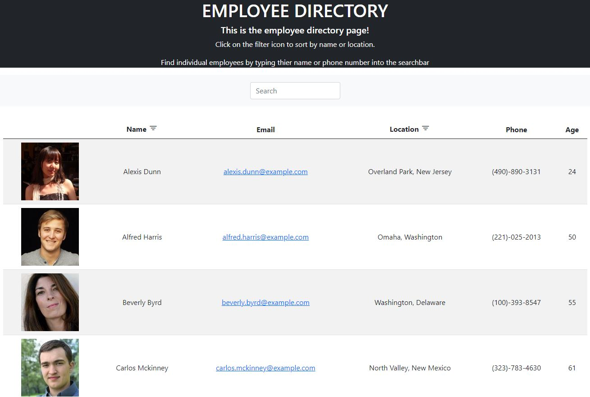

# Employee Directory

# Table of Contents 

1. [Description](#description)
2. [Installation](#installation)
3. [Usage](#usage)
4. [Demo](#demo)
5. [Questions](#questions)

## Acceptance Criteria:

Given a table of random users generated from the [Random User API](https://randomuser.me/), when the user loads the page, a table of employees should render. 
​
The user should be able to:
​
  * Sort the table by at least one category
​
  * Filter the users by at least one property.

## Description:

For this homework assignment, I was tasked with creating an employee directory. This directory will show employees information on a table. 
It will show the following:

    * Profile Picture
    * Name
    * Email
    * Location(city, state)
    * Phone Number
    * Age

There is also an icon button to the right of "Name" and "Location". If the icon is clicked, the employees will be filtered by either their first name or by the state. The search bar above the table can also be used to search for individual employees. Typing in either their name, email or phone number will render only them on the table. 

## Installation:

To run this application, npx create-react-app should be used. After that, certain node modules should be installed. 

The following image will be a snippet of my dependencies:

        

## Usage:

This is intended to be used to keep track of an employer's employees. 

## Demo:
The following link is a video that will showcase how to run the application.

* https://www.youtube.com/watch?v=oybFYwGo8hY

 

## Questions: 
If there are any questions that you may have, please contact me by the following:

* Github: https://github.com/vickphat
* Email: vickphat@gmail.com 
